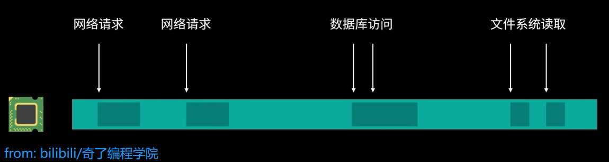
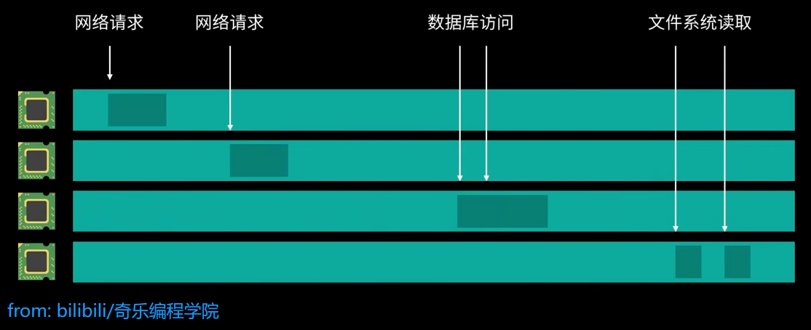
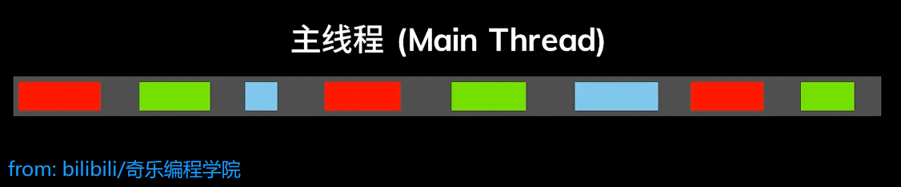

# Rust 精简入门

## 一、基础

 ```bash
 cargo new 项目名 --bin
 cargo new 项目名 --lib
 ```

### 1. 基本类型

+ 整数类型：`i8`，`i16`，`i32`，`i64`，`i128`，`isize`，`u8`，`u16`，`u32`，`u64`，`u128`，`usize`
+ 浮点类型：`f32`,`f64`
+ 布尔类型：`bool`，（`true` / `false`)
+ 字符类型：`char`（Unicode字符）
+ 单元类型：`()`


### 2. 变量

+ 默认不可变：`let x = 5;`
+ 可变变量：`let mut x = 5;`
+ 变量遮蔽：`let x = 5; let x = x + 1;`
+ 常量：`const MAX_POINIS: u32 = 100_000;`


### 3. 复杂类型

+ 元组：`let tup: (i32, f64, u8) = (500, 6.4, 1);`
+ 数组：`let a = [i32, 5] = [1, 2, 3, 4, 5];`
+ 切片：`&[i32] `, `&str`
+ 字符串：`String`, `&str`
+ 结构体：`struct User { username: String, ... }`
+ 枚举：`enum IpAddrKind { V4, V6 }`


### 4. 流程控制

+ `if / else`：`if condition { ... } else { ... }`
+ `loop`：无限循环， 使用`break`退出
+ `while`：`while condition { ... }`
+ `for`：`for element in collection { .. }`
+ `match`：模式匹配


### 5. 所有权

+ 规则：每个值有唯一所有者；所有者离开作用域，值被丢弃
+ 移动：`let s2 = s1;`（`s1` 不在有效）
+ 克隆：`let s2 = s1.clone();`


### 6. 引用和生命周期

+ 不可变引用：`&T`
+ 可变引用：`&mut T`
+ 借用规则：同时只能有一个可变引用或多个不可变引用
+ 生命周期：`'a`，确保引用有效

案例：
```Rust
use std::collections::HashMap;

fn main() {
    let query = String::from("name=Venus&age=24&hobby=coding");
    let qp = QueryParser::from_string(query.clone());
    println!("params: {:#?}", qp);
    
    let qp2 = EnhancedQueryParser::from_string(&query);
    println!("params: {:#?}", qp2);
    let name = qp2.params.get("name").unwrap();
    println!("name: {}", name);
}

#[derive(Debug)]
struct QueryParser {
    query: String,
    params: HashMap<String, String>
}

impl QueryParser {
    fn from_string(query: String) -> Self {
        // name=value&name=value
        let params: HashMap<String, String> = query.split("&")
            .map(|item| {
                let mut parts = item.split("=");
                let key = String::from(parts.next().expect("no key"));
                let value = String::from(parts.next().unwrap());
                (key, value)
            })
            .collect();

        Self {
            query,
            params,
        }
    }
}

#[derive(Debug)]
struct EnhancedQueryParser<'a> {
    query: &'a str,
    params: HashMap<&'a str, &'a str>
}

impl<'a> EnhancedQueryParser<'a> {
    fn from_string(query: &'a str) -> Self {
        let params: HashMap<&'a str, &'a str>  = query.split("&")
            .map(|kv| {
                let mut parts = kv.split("=");
                (
                    parts.next().unwrap(),
                    parts.next().unwrap()
                )
            })
            .collect();
        
        Self {
            query,
            params
        }
    }
}
```


### 7. 特征 Trait

+ 定义共享行为接口：
  ```Rust
  trait Summary {
      fn summarize(&self) -> String;
      fn default_behavior(&self) -> String {
          String::from("默认实现")
      }
  }
  ```

+ 为类型实现特性：
  ```Rust
  impl Summary for NewsArticle {
      fn summarize(&self) -> String {
          format!("{}, by {}", self.headline, self.author)
      }
  }
  ```

+ 特征约束：`fn notify<T: Summary>(item: &T) { .. }`

+ 多重约束：`fn notify<T: Summary + Display>(item: &T) { ... }`

+ where子句：
  ```Rust
  fn some_function<T, U>(t: &T, u: &U) -> i32
  	where T: Display + Clone,
  		  U: Clone + Debug
  {
      todo!()
  }
  ```

+ 特征对象：`Box<dyn Summary>`

+ 关联类型： 
  ```Rust
  trait Iterator {
      type Item;
      fn next(&mut self) -> Option<Self::Item>;
  }
  ```

+ 默认类型参数：`trait Add<RHS=Self> { .. }`

+ 完全限定语法：`<Type as Trait>::function()`

+ 超特征：`trait OutlinePrint: Display { ... }`

  + `Display`是`OutlinePrint`的 "父类"

+ 孤儿原则：只能为当前 crate 中的类型实现当前 crate 中的特征

+ 对象安全：
  对象安全的 trait 可以是 [trait对象](https://rustwiki.org/zh-CN/reference/types/trait-object.html) 的底层 trait。如果 trait 符合以下限定条件（在 [RFC 255](https://github.com/rust-lang/rfcs/blob/master/text/0255-object-safety.md) 中定义），则认为它是*对象安全的(object safe)*：

  - 所有的超trait [supertraits](https://rustwiki.org/zh-CN/reference/items/traits.html#supertraits) 也必须也是对象安全的。
  - 超类trait 中不能有 `Sized`。也就是说不能有 `Self: Sized`约束。
  - 它必须没有任何关联常量。
  - 所有关联函数必须可以从 trait对象 调度分派，或者是显式不可调度分派：
    - 可调度分派函数要求：
      - 不能有类型参数（尽管生存期参数可以有）
      - 作为方法时，`Self` 只能出现在[方法](https://rustwiki.org/zh-CN/reference/items/associated-items.html#methods)的接受者(receiver)的类型里，其它地方不能使用 `Self`。
      - 方法的接受者的类型必须是以下类型之一：
        - `&Self` (例如：`&self`)
        - `&mut Self` (例如：`&mut self`)
        - [`Box<Self>`](https://rustwiki.org/zh-CN/reference/special-types-and-traits.html#boxt)
        - [`Rc<Self>`](https://rustwiki.org/zh-CN/reference/special-types-and-traits.html#rct)
        - [`Arc<Self>`](https://rustwiki.org/zh-CN/reference/special-types-and-traits.html#arct)
        - [`Pin<P>`](https://rustwiki.org/zh-CN/reference/special-types-and-traits.html#pinp) 当 `P` 是上面类型中的一种
      - 没有 `where Self: Sized`约束（即接受者的类型 `Self`(例如：`self`) 不能有 `Sized`约束）。
    - 显式不可调度分派函数要求：
      - 有 `where Self: Sized`约束（即接受者的类型 `Self`(例如：`self`) 有 `Sized`约束）。


### 8. 智能指针

+ `Box，Deref`：相当于指针，与`*（解引用）`是逆运算
+ `Cell，RefCell`：实现内部可变性
+ `Rc`：实现多重所有权的引用


## 二、高级

### 1. 泛型

+ 函数：`fn largest<T>(list: &[T]) -> &T { ... }`
+ 结构体：`struct Point<T> { x: T, y: T }`
+ 枚举：`enum Option<T> { Some(T), None }`
+ 方法：`impl<T> Point<T> { ... }`


### 2. 闭包

+ 语法：`let add_one = |x | x + 1;`
+ 捕获环境：借用、可变借用、获取所有权
+ 特征：`Fn`，`FnMut`，`FnOnce`


### 3. 错误处理

+ `panic!`：不可恢复错误
+ `Result<T, E>`：可恢复错误
+ 处理方式：`match`，`unwrap()`，`expect()`，`?`运算符


### 4. 模块和库

+ `mod`
+ `crate`
+ 导入库 ：`crates.io（库所在网址）`
+ 测试
  ```Rust
  // Shape Trait
  pub trait  Shape {
      fn name(&self) -> String;
      fn area(&self) -> f64;
  }
  
  // Rectangle
  pub struct Rectangle {
      width: f64,
      height: f64,
  }
  impl Rectangle {
      fn new(width: f64, height: f64) -> Rectangle {
          return Rectangle {
              width: width,
              height: height,
          }
      }
  }
  impl Shape for Rectangle {
      fn name(&self) -> String {
          return "Rectangle".to_string();
      }
      fn area(&self) -> f64 {
          return self.width * self.height;
      }
  }
  
  // Circle
  pub struct Circle {
      radius: f64,
  }
  impl Circle {
      fn new(radius: f64) -> Circle {
          return Circle {
              radius: radius,
          }
      }
  }
  impl Shape for Circle {
      fn name(&self) -> String {
          return "Circle".to_string();
      }
      fn area(&self) -> f64 {
          return PI * self.radius * self.radius;
      }
  }
  
  
  // Sum
  pub fn calculate_all_shapes_totally_area<T: Shape>(shapes: &[T]) -> f64
  {
      shapes.iter().map(Shape::area).sum()
  }
  
  
  #[cfg(test)] // cfg（config) 配置属性
  mod tests {
      /*
          m_rust_test 的子模块
      */
      use super::*;
  
      #[test]
      fn test_rectangle_area() {
          let rect = Rectangle::new(10.0, 20.0);
          assert_eq!(rect.area(), 200.0); // assert_eq! 断言值是否相等
      }
  
      #[test]
      fn test_circle_area() {
          let circle = Circle::new(10.0);
          assert_eq!(circle.area(), PI * 100.0);
      }
  
      #[test]
      fn test_calculate_all_shape_totally_area() {
          let rect = Rectangle::new(10.0, 20.0);
          let circle = Circle::new(10.0);
          // let shapes = vec![rect, circle];
          let shapes = vec![rect];
          /* !!!重点：
              <T: Shape> 泛型在接受第一参数后， 就已经单态化（monotonicity），不再支持 Circle
              可以使用 trait 对象解决：
                  pub fn calculate_all_shapes_totally_area(shapes: &[&dyn Shape]) -> f64
                  {
                      shapes.iter().map(|shape| shape.area()).sum()
                  }
  
                  let shapes: Vec<&dyn Shape> = vec![&rect, &circle];
          */
  
          assert_eq!(calculate_all_shapes_totally_area(&shapes), 200.0);
      }
  }
  ```

  


### 5. 多线程

学习多线程和异步前需要搞懂的两个问题：
#### （1）并发/并行/异步/同步

> **并发（Concurrency）、并行（Parallelism）、异步（Asynchronous）、同步（Synchronous）**
>
> + 并发：宽泛概念，单纯代表计算机能够同时执行多项任务
>
> + 并行：针对与多核处理器，实现多个任务真正意义上的同时运行
>   
>
> + 同步和异步：是指两种不同的编程模型
>
>   + 同步：前一个任务执行完成后，再开始执行下一个任务，因此在同步中没有并发或者并行的概念。
>
>   + 异步：任务之间没有相互等待，并发执行。
>
>     > 一个典型实现异步的方式就是   ---  “多线程”

#### （2）多线程编程/异步编程

> **多线程编程（Multi-threading） vs （单线程）异步编程（Asynchronous Programming）**
>
> ==我们应该如何选择哪种编程方式呢？==
>
> 针对与I/O密集型操作
>
> + 采用单线程异步操作
>   
> + 采用多线程编程
>   
>   缺陷：线程本身会占有更多的额外内存开销，并带来线程切换开销
>
> 针对计算密集型操作
>
> + 采用单线程异步操作
>
>   > 本质还是一个核心在执行，不会减少整个程序的运行开销
>
> + 采用多线程编程
>
>   > 多个核心同时处理，更快执行完任务

+ 创建线程：`thread::spawn(|| { ... })`
+ 消息传递：`mpsc::channel()`
+ 共享状态：`Mutex<T>`，`Arc<T>`
+ 线程安全：`Arc<Mutex<T>>`，`RwLock<T>`


### 6. 异步编程



+ `async` / `await`：异步函数和等待点
+ `Future` 特征：表示异步计算
+ 异步运行时：`tokio`，`async-std`
+ 异步函数：`async fn read_file() -> Result<String> { ... }`
+ 等待 Future：`let content = read_file().await?;`
+ 并发执行：`join!`，`select!`
+ 异步流：`Stream` 特征，类似于同步的 `Iterator`
+ 异步互斥锁：`tokio::sync::Mutex`


### 7. 宏

+ 声明宏：`macro_rules!`
+ 过程宏：
  + 派生宏：`#[derive(Debug)]`
  + 属性宏：`#[get("/users")]`
  + 函数宏：`sql!(SELECT * FROM posts)`


### 8. 不安全的 Rust

+ 不安代码块：`unsafe { ... }`
+ 裸指针：`*const T`、`*mut T`


